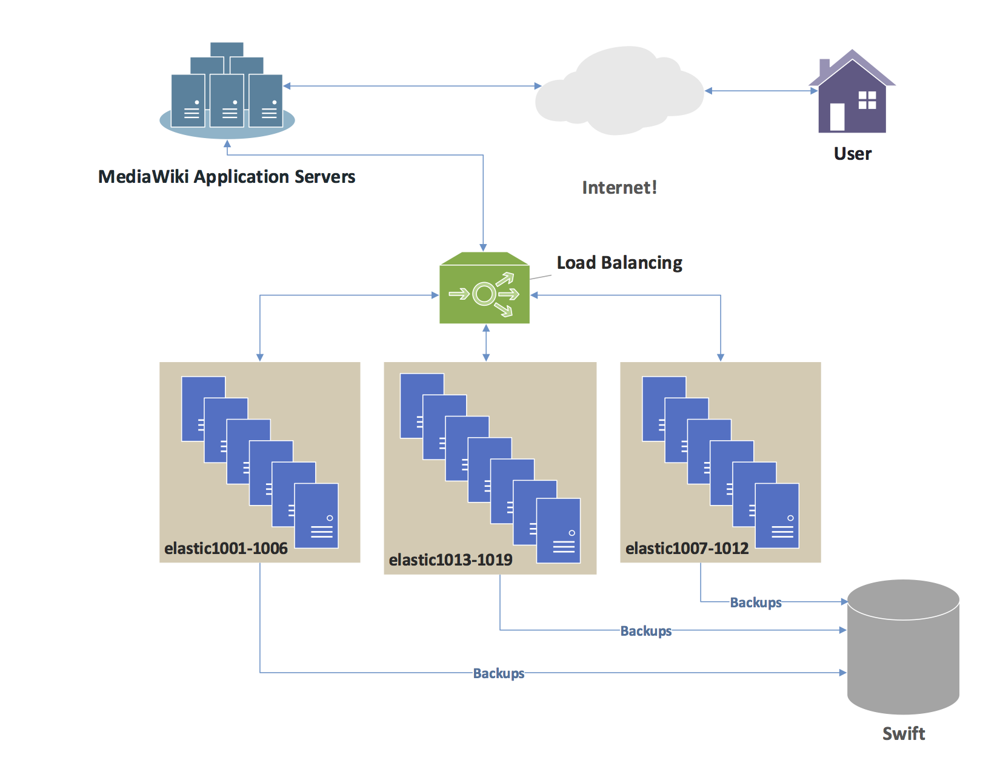

# 0x0F-load_balancer

<h2>What is a Load Balancer?</h2>

A load balancer is a networking device or software that distributes incoming network traffic across multiple servers to optimize performance, ensure high availability, and prevent any single server from being overloaded. It acts as a traffic cop, routing client requests to the appropriate server that can handle the request efficiently.

<h2>Load balancers perform the following functions:</h2>

<ul>
<li>
Efficiently distribute client requests: Load balancers distribute incoming client requests across multiple servers, ensuring that the workload is evenly distributed and preventing any single server from being overwhelmed.
</li>
<li>
Ensure high availability and reliability: Load balancers only send requests to servers that are online and available, ensuring that if one server goes down, the traffic is automatically redirected to the remaining online servers.
</li>
<li>
Flexibility to add or subtract servers: Load balancers provide the flexibility to add or remove servers based on demand, allowing for easy scalability and resource management.
</li>
</ul>